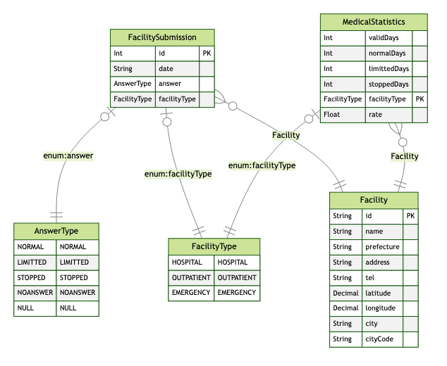

# medical-load-with-covid19

コロナ期間の医療提供体制データを元にした、地域の医療体制の強度を可視化するサービス  

## 使用したオープンデータ

https://corona.go.jp/dashboard より、**全国医療機関の医療提供体制の状況 オープンデータ**を使用。  

- API
  - https://opendata.corona.go.jp/api/covid19DailySurvey
- レスポンスに含まれるデータ
  - データ提供元の医療機関情報
  - 医療機関の営業体制
    - 通常・制限・停止・未回答・設置なし

## アイデア

- コロナウイルスの蔓延期間に稼働できている日数が多い＝パンデミックに耐えられる医療機関と言えるのでは？
  - 回答日数のうちの営業状況で指数化できそう
- 範囲指定して、エリア内の医療機関の指数があると、家探しの観点で需要あるかも

## 技術的にやりたいこと

- 位置情報を用いた、物件の範囲検索
  - ElasticSearchのgeo_distanceクエリのようなイメージ
- 更新データ取り込みの日次バッチ作成
  - オープンデータのAPIレスポンスをDBに格納
- 蓄積データを分析するバッチ作成
  - DBを読み込み、分析して別テーブルへ格納

## テーブル設計



- 病院データテーブル
- APIで取得できる日々の提出データ格納テーブル
- 提出データの分析結果格納テーブル

## デモ（GeoJson）

[こちら](./demo.geojson)


## 簡単な使い方

1. 中心となる緯度経度と、半径になる距離(km)を決める
2. jqをインストールする  
  ```bash
  brew install jq
  ```
3. パラメータをクエリで指定してコマンドでAPIを実行する  
  ```
  curl 'https://5ii04kds12.execute-api.ap-northeast-1.amazonaws.com/Prod/rate?lon=139.7711&lat=35.6916&distance=2' | jq '.geoJson' | pbcopy
  ```
4. https://geojson.io/ にアクセスし、クリップボードの内容を画面右側のエディタ部分へ貼り付ける
